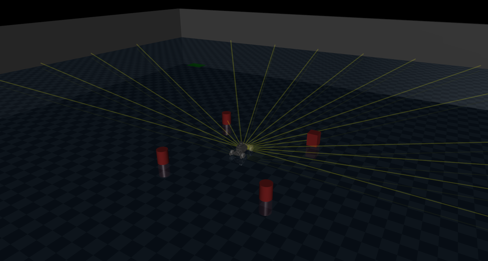
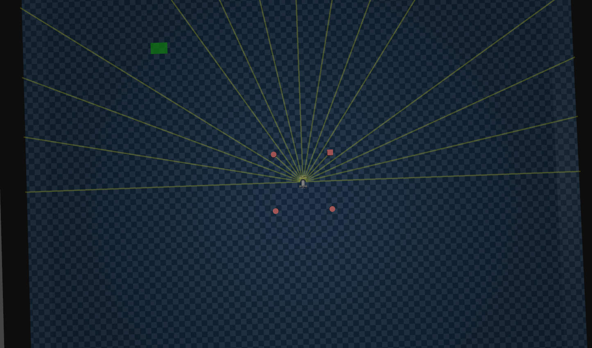
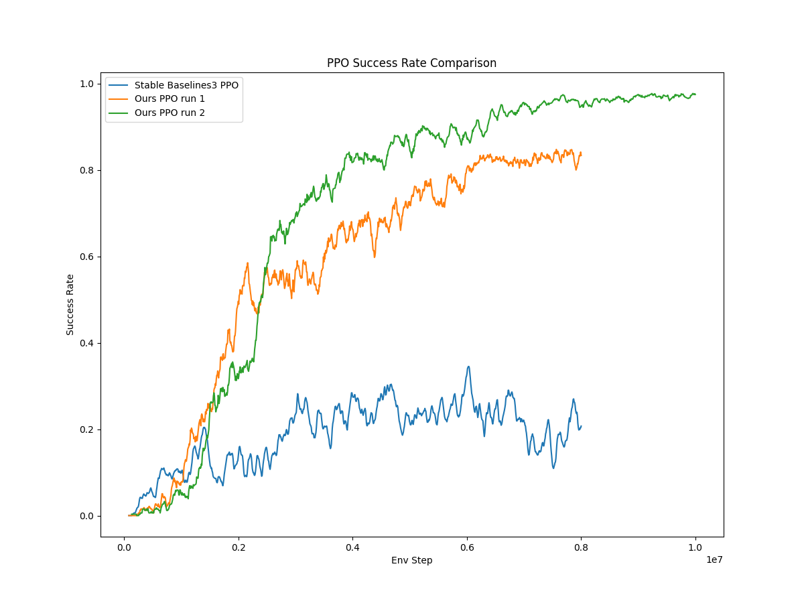
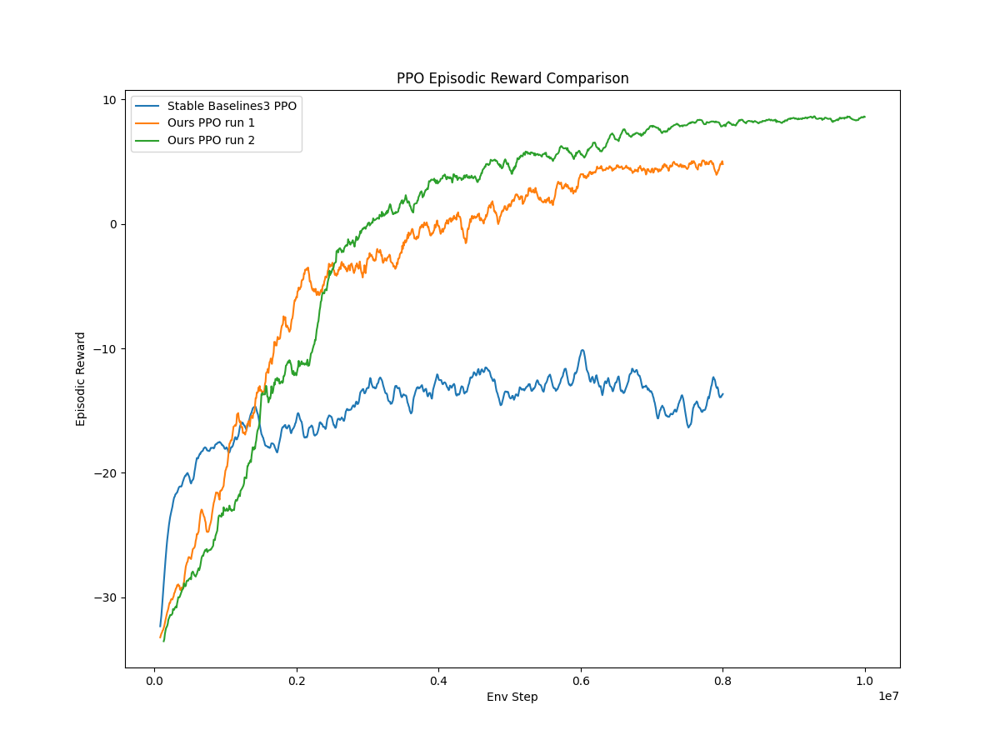
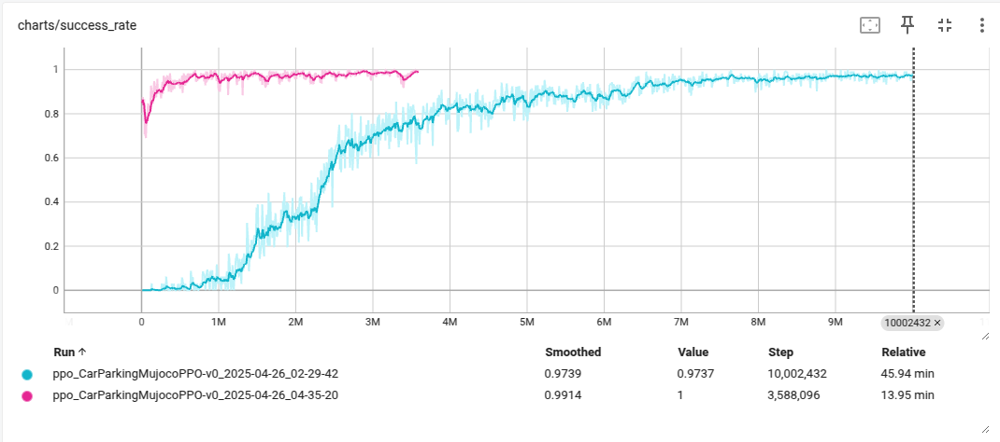
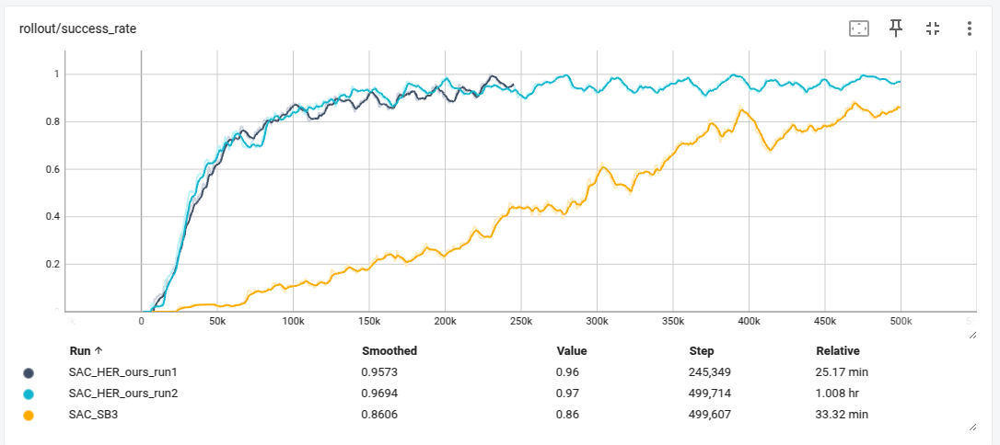
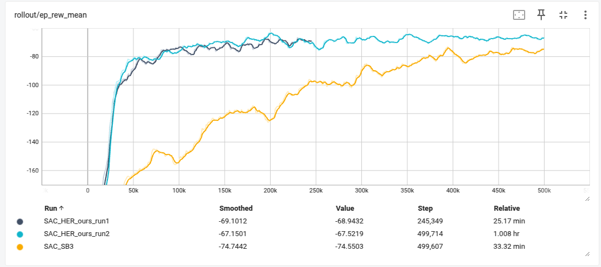

# MuJoCo Car Parking

A reinforcement learning environment for car parking using MuJoCo physics simulator. This project implements a car parking task where an agent learns to park a car in a designated spot using various reinforcement learning algorithms.





## Features

- Custom MuJoCo-based car parking environment with realistic physics
- Range sensors for obstacle detection
- Random parking spot configurations
- Collision detection and handling

## Requirements

- Python >= 3.12
- MuJoCo >= 3.3.1
- Gymnasium[mujoco,other] >= 1.1.1
- Stable-Baselines3 >= 2.6.0
- Pygame >= 2.6.1
- TensorBoard >= 2.19.0
- GLFW >= 3.3.8

## Installation

1. Clone the repository:
```bash
git clone https://github.com/yourusername/mujoco-parking.git
cd mujoco-parking
```

2. Install UV for python package management
```bash
curl -LsSf https://astral.sh/uv/install.sh | sh
```

3. Sync Depedences
```bash
uv sync
```


## Project Structure

- `car_parking_mujoco.py`: Main environment implementation
  - Custom Gymnasium environment
  - Continuous action space for steering and throttle
  - Rich observation space with position, velocity, and range sensors
  - Custom reward function with collision penalties
- `train_mujoco_ppo_ours.py`: ours implementation of PPO training script
- `train_mujoco_sac.py`: SAC training script with HER
- `test_mujoco.py`: Testing script
- `keyboard.py`: Manual control interface
- `models/`: Contains MuJoCo model files
- `logs/`: Training logs and TensorBoard data

## Usage

### Training

#### PPO Training
Phase 1 learns how to park correctly

```bash
uv run train_mujoco_ppo_ours.py --train
```

After Phase 1 training completed, copy your pretrained model:

```bash
cp runs/ppo_CarParkingMujocoPPO-v0_[DATETIME]/model_best.pt model_best_ppo_phase1.pt
```

Then phase 2 learns how to park and avoid obstacles with pretrained model from previous phase
```bash
uv run train_mujoco_ppo_ours.py --train --next-phase --model-path model_best_ppo_phase1.pt
```

This will train our PPO agent with:
- 8 parallel environments
- Mini batch size of 1024
- 1024 steps per rollout
- 10 epochs of update per rollout
- Learning rate of 3e-4
- Gamma of 0.95
- Cosine annealing learning rate
- entroy regularization of 0.01

To train the agent using SAC with HER:
```bash
uv run train_mujoco_sac_her_sb3.py --train
```
This will train a SAC agent with:
- Hindsight Experience Replay (HER)
- 4 sampled goals
- Future goal selection strategy
- Learning rate of 1e-3
- Gamma of 0.95
- Batch size of 1024
- Tau of 0.05

### Manual Control

To control the car manually using keyboard to test our mujoco's XML model file:
```bash
uv run keyboard.py
```
Keyboard controls:
- Arrow Up/Down: Forward/Backward
- Arrow Left/Right: Turn Left/Right
- Space: Pause/resume simulation
- Esc: Quit
- Mouse: Camera control (rotate, move, zoom)


## Perforamnce

### Comparison of our implemented tuned PPO with Stable Baselines' original PPO





Second Phase Training (red)


### Comparison of our tuned HER-SAC-SB3 with Stable Baselines' original SAC







### View my training logs by yourself
```
uv run tensorboard --logdir runs
```

### Test our pretrained model

#### Test our PPO
Test our pretrained model

```bash
uv run train_mujooc_ppo_ours.py --next-phase --model-path model_best_ppo_phase2.pt --render
```

Will give **100%** success rate

Or test your own pretrained model:
```bash
uv run train_mujooc_ppo_ours.py --next-phase --model-path runs/ppo_CarParkingMujocoPPO-v0_[DATETIME]/model_best.pt
```

#### Test SAC
Test our pretrained model
```bash
uv run train_mujoco_sac_her_sb3.py --model-path model_best_sac.zip --render
```
Will give **98%** success rate


Or test your own pretrained model:
```bash
uv run train_mujoco_sac_her_sb3.py --model-path checkpoints/car_parking_mujoco_sac_[STEPNUM]_steps.zip
```


## Environment Details

The car parking environment features:
- Continuous action space for steering and throttle control
- Observation space includes:
  - Car position and orientation
  - Linear velocity
  - Range sensor (laser scan to avoid obastacles) readings (17 sensors)
  - Goal position and orientation
- Custom reward function with:
  - Proximity to goal reward
  - Collision penalty
  - Success reward
- Multiple random parking spot configurations:
  - Front parking (x=5.0, random y)
  - Side parking (random x, y=±5.0)
- Collision detection with walls and obstacles
- Maximum episode length of 250 steps


### Reward Design

**Step Reward**
$$
p = (x, y, v_x, v_y, cos(\theta), sin(\theta)) \\
w = (1, 1, 0, 0, 0.1, 0.1)
$$

$$
r_s =  -|| w \cdot |p_c - p_g|  ||_2
$$

where $x, y$ are positions on plane, $v_x, v_y$ are velocities, $\theta$ is heading angle
$p_v$ is car's information vector, $p_g$ is goal's (parking spot) information vector

**Collision Reward**

$$
r_c = -15
$$

**Success Reward**
$$
r_g = 15
$$


The design of such rewards is to make guide our vehicle to it's heading towards the the parking spot with correct heading direction.

We changed the scale of reward from 100 to 15 which increased the stability of our training.


## Discussion

### For PPO


We carefully choose a reward scale factor so that values used for training will not be too large to cause value explosion during training.

We use curriculum learning to train our agent in two phases:

1. Phase 1: Simplified Environment
   - Focuses on basic parking maneuvers
   - No obstacles only walls

2. Phase 2: Full Environment
   - Load obstacles
   - Learn to avoid obstacles and parking

This approach helps the agent learn more efficiently by breaking down the complex parking task into manageable stages.

#### Behavior Observed

It looks like the learned agent

- Cannot parking in correct heading angle when parking spot is in difficult position which needs two stage parking
- Need to learn to stop or deaccelerate when near reaching parking spot


### For SAC

We use Hindsight Experience Replay (HER) to accelerate the training process by allowing the agent to learn from failed attempts. HER works by relabeling failed trajectories with alternative goals that were achieved during the episode, effectively creating more successful training examples from each episode. This technique is particularly effective for sparse reward environments like our car parking task, where the agent only receives a positive reward when successfully parking.